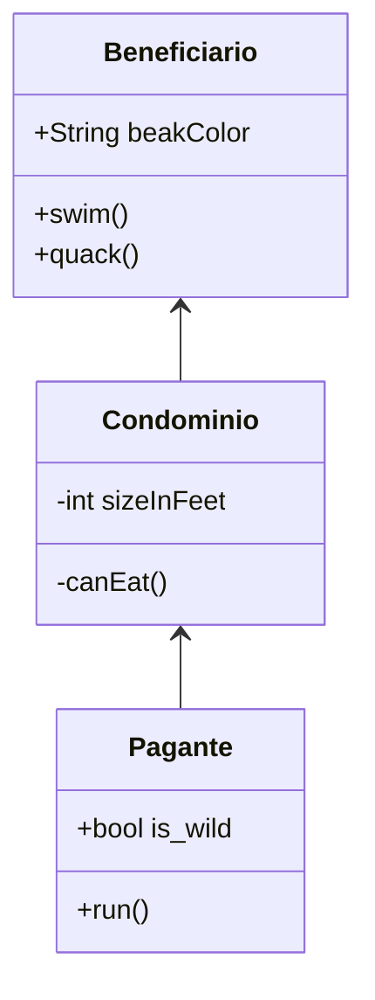

# Gestão de Condomínios

- Cadastro de Condomínios;
- Cadastro de Apartamentos de um Condomínio;
- Cadastro do Morador do Apartamento (Dono ou Inquilino);
- Rateio de contas do condomínio;
- Geração de Relatórios (tabelas e gráficos);
- Geração de Boletos com os valores calculados pelo sistema;
- Envio automatizado de e-mails para os inquilinos/proprietários;


---


## Models

Beneficiário:

```
yarn sequelize model:generate --name Beneficiario --attributes nome_completo:string,cprf:string,token_acesso:string,token_conta:string,cep:string,uf:string,localidade:string,bairro:string,logradouro:string,numero:string,complemento:string
```

Condomínio:

```
yarn sequelize model:generate --name Condominio --attributes nome:string,cep:string,uf:string,localidade:string,bairro:string,logradouro:string,numero:string,id_beneficiario:integer
```

Pagante:

```
yarn sequelize model:generate --name Pagante --attributes nome_completo:string,cprf:string,complemento:string,id_condominio:integer
```

Boleto:

```
yarn sequelize model:generate --name Boleto --attributes emissao:string,vencimento:string,documento:string,numero:string,titulo:string,valor:string,id_beneficiario:integer,id_condominio:integer,id_pagante:integer
```

### Relationships & Eager Loading

